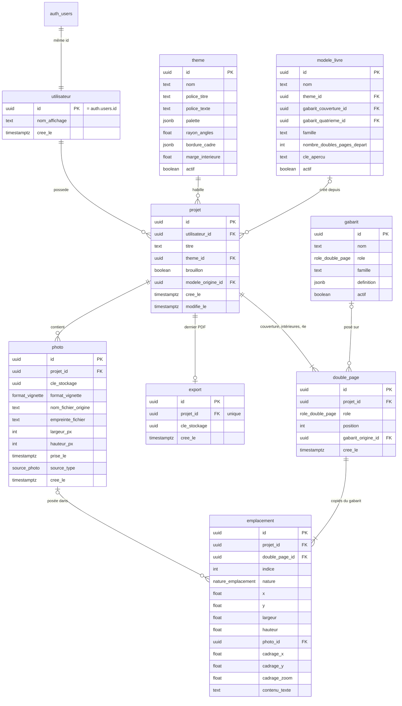

# Modèle de données

Les migrations de `supabase/migrations/` font foi pour les types exacts. Ce document explique les règles et leurs raisons.

Tables et colonnes sont en **snake_case**, la convention de PostgreSQL : pas de guillemets à écrire en SQL.

## Schéma

Tout ce qui appartient à un livre descend d'un `projet`, et **rien n'est partagé entre utilisateurs**. `gabarit`, `theme` et `modele_livre` forment le catalogue, en lecture seule.

---

## Principe : copier ou référencer

> **Ce qui casserait un livre existant si on le modifiait est copié ; ce qui l'améliore est référencé.**

- La **géométrie du gabarit** est copiée dans les emplacements. Modifier un gabarit ne déplace pas les photos d'un livre déjà composé.
- Le **thème** est référencé. Corriger une couleur profite à tous les livres.
- Le **modèle de livre** est copié dans le projet à sa création.

---

## Entités

### utilisateur

L'email, le mot de passe et les sessions sont dans `auth.users`, gérés par Supabase. `utilisateur.id` est le même identifiant : `auth.uid()` désigne directement la ligne. Elle est créée par un trigger à l'inscription.

Supprimer un compte supprime en cascade ses projets et leur contenu. **Les fichiers de Storage ne suivent pas la cascade** : le front vide le dossier `{utilisateur_id}/` avant.

### projet

- **Pas de champ format** : le format est unique, il vit dans les dimensions des gabarits.
- **Pas de compteur** de pages ou de photos : ça se calcule, et un compteur stocké se désynchronise.
- **`brouillon` est une intention** du Créateur. Ni l'export ni la composition n'y touchent.
- **`modele_origine_id` est informatif** : passe à `NULL` si le modèle est supprimé.
- **`modifie_le` est tenu par trigger** à chaque écriture dans le projet ou son contenu. Il trie l'écran « Mes livres ».

Créé par `creer_projet`. Le navigateur ne peut ensuite modifier que `titre` et `brouillon`.

### photo

Rattachée au **projet** : deux livres qui utilisent la même photo la stockent deux fois.

- **Une photo n'existe en base qu'une fois ses fichiers déposés** : pas d'état de traitement, pas d'échec stocké.
- **`empreinte_fichier`** (SHA-256 du fichier d'origine) est unique par projet : bloque les doublons stricts.
- **`largeur_px` et `hauteur_px`** décrivent l'original stocké, celui qui part dans le PDF et sert au calcul des 300 DPI.
- **`cle_stockage`** est un UUID opaque tiré par le navigateur, partagé par l'original et la vignette.
- **`format_vignette`** (`webp` ou `jpeg`) donne l'extension de la vignette.
- **`prise_le`** vient de l'EXIF et peut être vide.

Une résolution insuffisante est un avertissement, jamais un échec.

**Suppression** : le front supprime la ligne, puis les fichiers. Une interruption laisse au pire un fichier inutile, jamais une ligne sans fichier.

### gabarit

Catalogue, créé par `supabase/seed.sql`.

Un cadre de `definition` : `{ indice, x, y, largeur, hauteur, nature: "photo" | "texte" }`, en **millimètres**. Un cadre à cheval sur le pli se lit dans sa géométrie.

`famille` regroupe les gabarits d'un même esprit : le moteur de gabarits filtre sur `role` et `famille`.

**Un gabarit ne contient que de la géométrie.** Couleurs, polices, bordures et coins arrondis relèvent du thème.

Un gabarit mal formé échoue bruyamment : Zod le rejette à la lecture côté front, et `creer_double_page` échoue sur un cadre incomplet grâce aux contraintes d'`emplacement`.

### theme

Catalogue de trois ou quatre thèmes, pas de nuancier libre. Un thème utilisé ne peut pas être supprimé (`RESTRICT`) : on le désactive.

### modele_livre

Catalogue, lisible par les visiteurs : il s'affiche avant l'inscription.

`creer_projet` copie le modèle : thème, couverture, 4e, et `nombre_doubles_pages_depart` intérieures. Les gabarits des intérieures sont choisis par le moteur de gabarits du front ; la fonction vérifie leur nombre, leur rôle et leur famille, puis crée tout d'un coup. **Un projet sans couverture ni 4e n'existe jamais.**

### double_page

**L'unité est la double page, pas la page** : une photo panoramique traverse le pli en un seul cadre. Coût : une conversion à l'affichage (la double page 3 correspond aux pages 6 et 7).

- **La couverture et la 4e sont des doubles pages**, repérées par leur `role` : une seule de chaque par projet.
- **`position`** est vide pour la couverture et la 4e, et va de 1 à N sans trou pour les intérieures.
- **Pas d'unicité sur `position`** : une renumérotation passe brièvement par des rangs en double.
- **Le navigateur n'écrit jamais dans cette table** : tout passe par les fonctions d'ordre, sous le verrou du projet.

### emplacement

`nature` et la géométrie sont **copiées du gabarit**. Le navigateur ne peut modifier que `photo_id`, le cadrage et `contenu_texte`.

- **Un emplacement peut être vide.** Supprimer une photo vide les emplacements qui la portaient.
- **Deux emplacements peuvent porter la même photo** : dupliquer une double page ne copie aucun fichier.
- **La photo vient du même projet que l'emplacement**, garanti par une clé étrangère sur `(projet_id, photo_id)`.
- **Une table pour deux natures** : les colonnes inutiles restent vides, un `CHECK` garantit la cohérence.
- **Le cadrage tient en trois colonnes** : `cadrage_x` et `cadrage_y` placent le centre visible (entre 0 et 1), `cadrage_zoom` vaut au moins 1. Ce repère ne dépend ni du cadre ni de la résolution.
- Un emplacement vidé peut garder son ancien cadrage : sans effet, écrasé à la pose suivante.

### export

Au plus **un par projet** : le dernier PDF réussi.

**La ligne n'est écrite qu'une fois le PDF déposé** : elle désigne toujours un fichier qui existe. Un rendu en cours ou échoué ne vit que dans l'onglet. L'ancien fichier n'est supprimé qu'après le dépôt du nouveau.

« Exporté et à jour » se calcule : `export.cree_le` postérieur à `projet.modifie_le`.

---

## Pourquoi `projet_id` partout

`double_page`, `emplacement`, `photo` et `export` portent `projet_id`, même quand on pourrait le retrouver par jointure.

Raison : toutes les règles RLS deviennent la même, `est_mon_projet(projet_id)`. Une règle qui remonte trois tables est difficile à relire, et c'est là que naissent les failles.

La valeur ne peut pas mentir : sur `double_page` et `emplacement`, seules les fonctions SQL l'écrivent ; sur `photo` et `export`, la RLS refuse un projet qui n'est pas le sien.

---

## Contraintes

| Règle | Mécanisme |
|---|---|
| `position` vide si et seulement si la double page n'est pas intérieure | `CHECK ((position IS NULL) = (role <> 'interieur'))` |
| Une seule couverture et une seule 4e par projet | Unicité partielle `(projet_id, role) WHERE role <> 'interieur'` |
| Pas deux fois le même fichier dans un projet | Unicité `(projet_id, empreinte_fichier)` |
| Un seul export par projet | Unicité `projet_id` |
| Emplacement cohérent avec sa nature | `CHECK` sur `nature`, `photo_id`, cadrage, `contenu_texte` |
| Bornes du cadrage | `CHECK` : `cadrage_x`, `cadrage_y` entre 0 et 1, `cadrage_zoom >= 1` |
| Photo posée du même projet | Clé étrangère `(projet_id, photo_id)` → `photo (projet_id, id)`, `ON DELETE SET NULL (photo_id)` |

Les énumérés (`role_double_page`, `nature_emplacement`, `source_photo`, `format_vignette`) sont des types PostgreSQL. Les clés étrangères sont en `ON DELETE CASCADE`, sauf mention contraire.

### Droits par colonne

La RLS choisit les **lignes** modifiables, pas les **colonnes**. Les colonnes modifiables depuis le navigateur sont donc accordées une à une :

| Table | Colonnes modifiables |
|---|---|
| `utilisateur` | `nom_affichage` |
| `projet` | `titre`, `brouillon` |
| `emplacement` | `photo_id`, `cadrage_x`, `cadrage_y`, `cadrage_zoom`, `contenu_texte` |

Ainsi, un Créateur ne peut ni déplacer un cadre, ni rattacher son livre à quelqu'un d'autre.

---

## Règles garanties par les fonctions SQL

Ce qu'une contrainte ne sait pas dire (comparer deux tables, écrire plusieurs lignes ensemble) est garanti par une fonction. Tests dans `supabase/tests/`, lancés par `supabase test db`.

| Règle | Fonction |
|---|---|
| Un projet naît avec couverture, intérieures et 4e, ou pas du tout | `creer_projet` |
| Le modèle est actif ; les gabarits intérieurs sont en bon nombre et de sa famille | `creer_projet` |
| Le gabarit est actif et a le même rôle que la double page | `creer_double_page`, `changer_gabarit` |
| La géométrie du gabarit est copiée dans les emplacements | `creer_double_page` |
| Les intérieures vont de 1 à N, sans doublon ni trou | `inserer_double_page`, `deplacer_double_page`, `supprimer_double_page`, `dupliquer_double_page` |
| La copie se place juste après la source et porte les mêmes photos | `dupliquer_double_page` |
| La couverture et la 4e ne se déplacent, ne se suppriment ni ne se dupliquent | Fonctions d'ordre |
| Les opérations d'ordre d'un même projet passent l'une après l'autre | Verrou en tête de chaque fonction |
| Le projet d'un autre est « introuvable », jamais « interdit » | Toutes, comme la RLS |

---

## Types de colonnes

- **Identifiants en `uuid`**, générés par la base (`gen_random_uuid()`). Visibles dans les adresses, ils ne révèlent ni le volume ni les identifiants voisins. `cle_stockage` est tiré par le navigateur, car il doit exister avant la ligne.
- **Millimètres en `double precision`** : c'est le type du JSON des gabarits et des calculs de pdf-lib. L'imprécision binaire ne se voit pas à l'impression.
- **Horodatages en `timestamptz`** : le fuseau est stocké.
- **Types TypeScript générés** par `supabase gen types` : ils ne peuvent pas diverger du schéma.

---

## Volontairement absent

- Bibliothèque de photos partagée entre projets.
- Curation : scores, suggestions.
- Historique des versions d'un livre, historique des exports.
- Partage, collaboration, commentaires.
- Réglages de style par livre : le thème suffit.

---

## Priorité documentaire

Les **spécifications fonctionnelles priment sur ce document** pour les écrans et leurs états.
